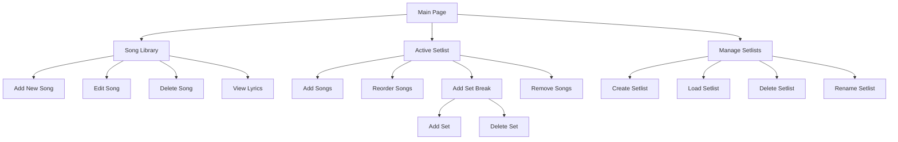

# Setlist Manager Features & Flow

## Application Architecture
See the detailed application architecture diagram in [application-flow.drawio](./application-flow.drawio)

## Application Flow

## Core Features

### Song Management
- **Add New Song**
  - Required fields: Name, Artist, Key, Tempo, Duration
  - Optional: Lyrics
  - Validation ensures all required fields are filled
  - Green submit button when form is valid

- **Edit Song**
  - Modify any song details
  - Always-active green save button
  - Immediate updates

- **View Lyrics**
  - Modal display
  - Scrollable lyrics view
  - Preserves formatting and line breaks

### Setlist Management
- **Active Setlist**
  - Drag-and-drop song reordering
  - Visual indicators for set breaks
  - Duration calculations per set
  - Total setlist duration

- **Set Breaks**
  - Add breaks between songs
  - Coffee cup icon for adding sets
  - White trash icon for removing sets
  - Automatic set numbering

### Multi-Device Support
- Real-time synchronization
- Changes reflect across all devices
- Automatic data persistence
- Local storage backup

## User Interface
- Dark theme
- Responsive design
- Touch-friendly controls
- Consistent icon usage:
  - Coffee cup: Add/manage sets
  - Plus: Add new items
  - Trash: Delete items
  - Document: View lyrics

## Data Structure
- Songs stored with unique IDs
- Setlists maintain song references
- Break markers separate sets
- Timestamps track changes

## Technical Implementation
- Next.js 14 framework
- React components
- JSON data storage
- PWA capabilities
- Real-time polling sync
